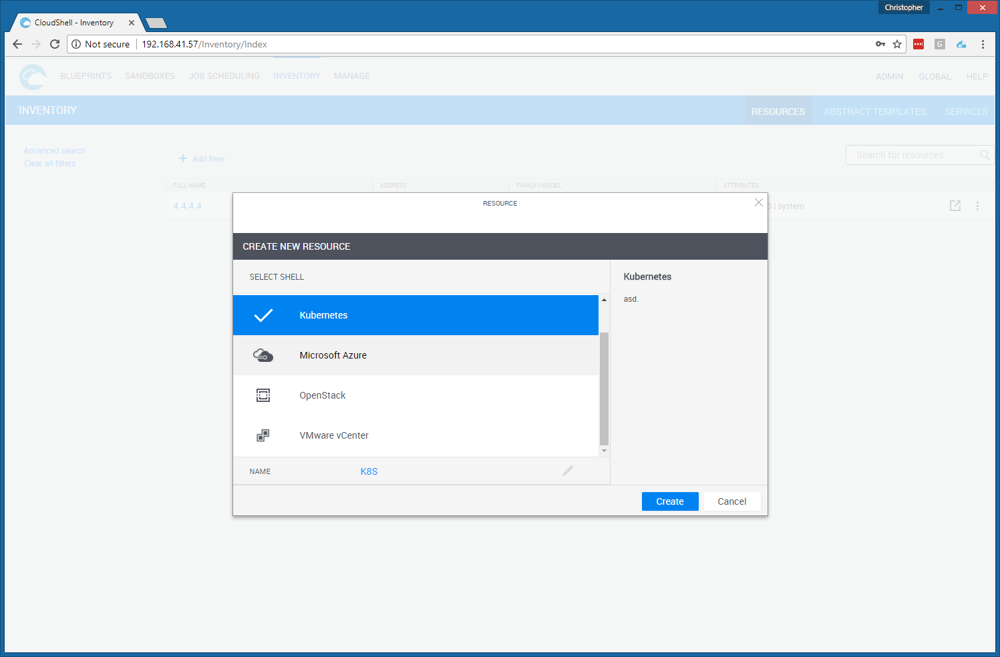
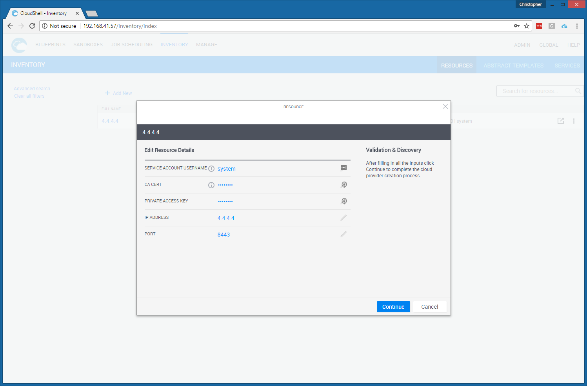
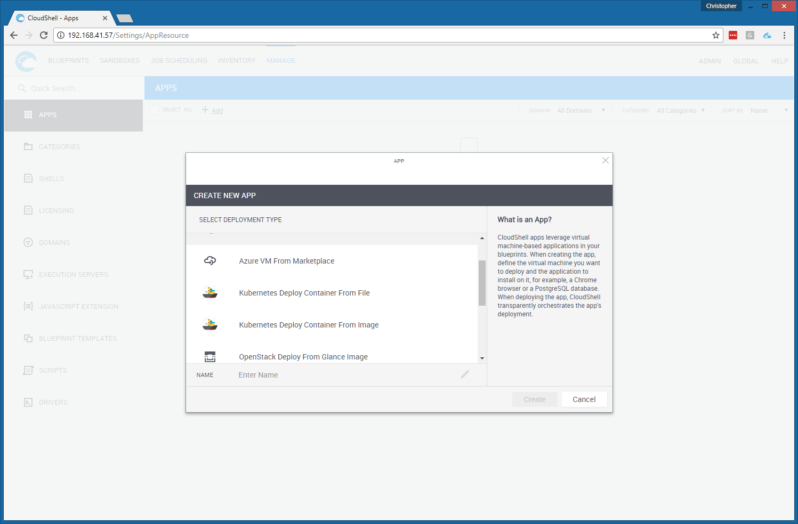
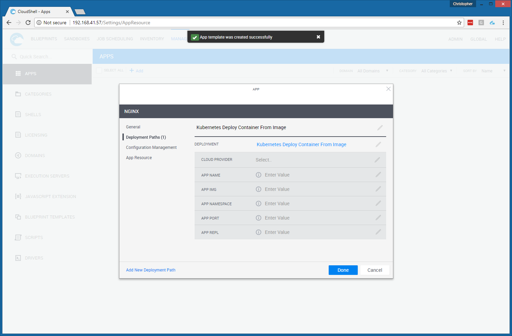
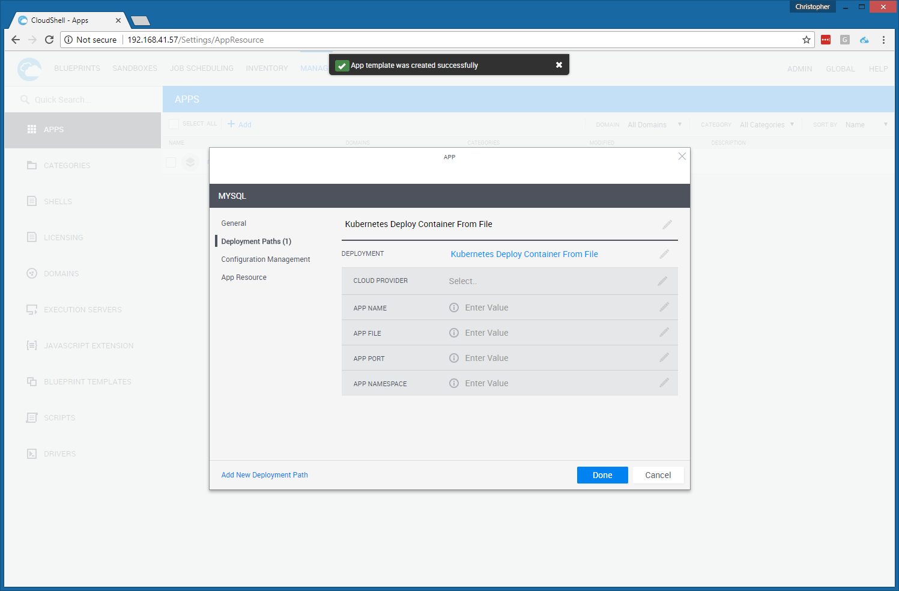

# K8-Cloud-Provider
This is a proof of concept skunkworks project to make a cloud provider for Kubernetes for CloudShell

## Assumptions
* CloudShell version 8.3 EA
* Kubernetes installed and pre-configured

## How to
* Run the shell script `package.sh` from the directory it is located in. It will spit out K8ShellPkg.zip
* Log into CloudShell web interface
* If running Chrome, drag and drop the zip file into the web portal. If not running Chrome, click on your username in the top right and choose "Import Package" and point to the zip file
* There is a bug with a python package! To work around this, download https://files.pythonhosted.org/packages/b6/ff/5eaa688dd8ce78913f47438f9b40071a560126ac3e95f9b9be27dfe546a7/python-dateutil-2.4.2.tar.gz and https://files.pythonhosted.org/packages/54/bb/f1db86504f7a49e1d9b9301531181b00a1c7325dc85a29160ee3eaa73a54/python-dateutil-2.6.1.tar.gz and place those .tar.gz files in `C:\Program Files (x86)\QualiSystems\CloudShell\Server\Config\Pypi Server Repository` folder on the Quali server

## About
* The code that makes this work is based on another python script by [Mike Williams](https://github.com/mpw07458/K8S-Deploy/blob/master/pure-play/drivers/K8S_App_Shell/src/K8S_App_Shell_OS.py)
* CloudShell Cloud Provider Shell is not officially supported until 9.0 
* Tear down isn;t implemented yet

## Screenshots

